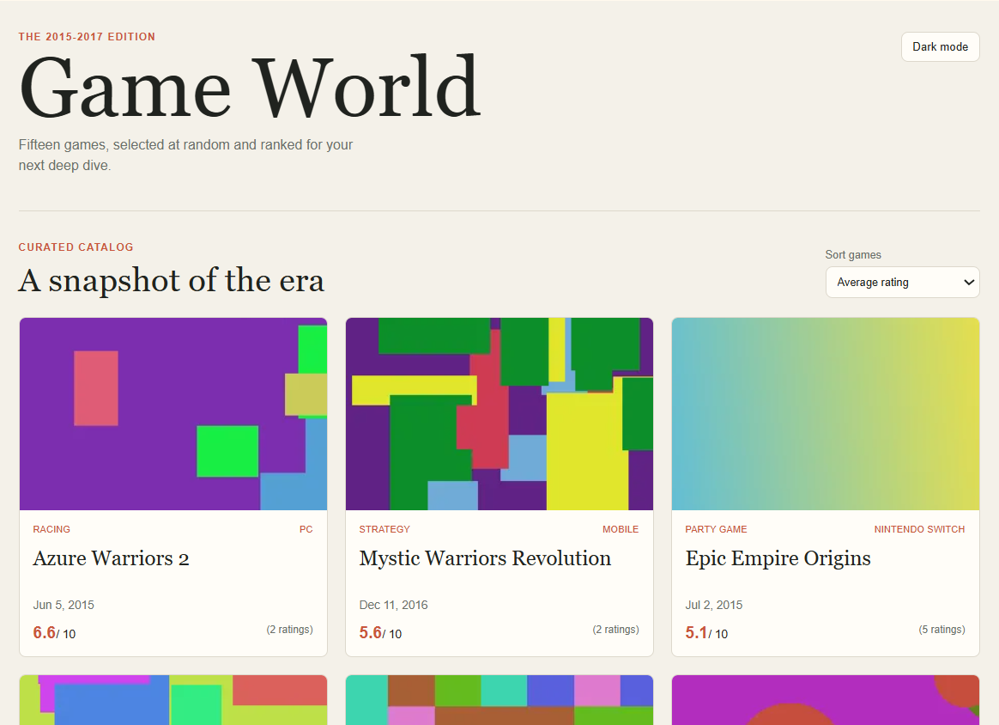
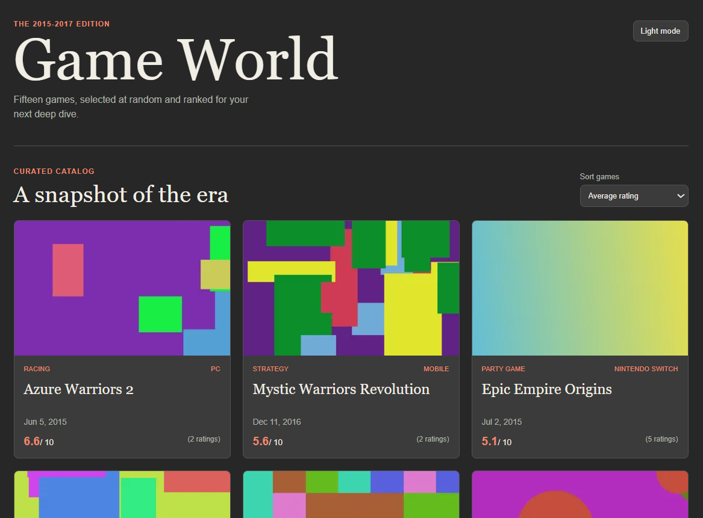
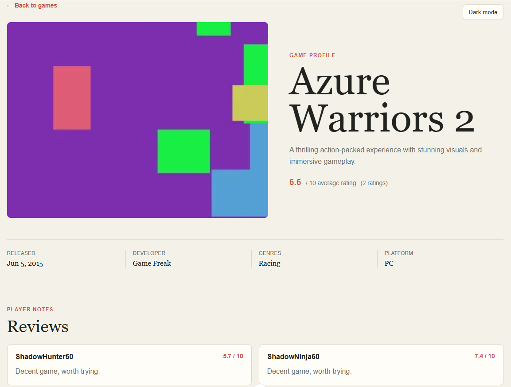
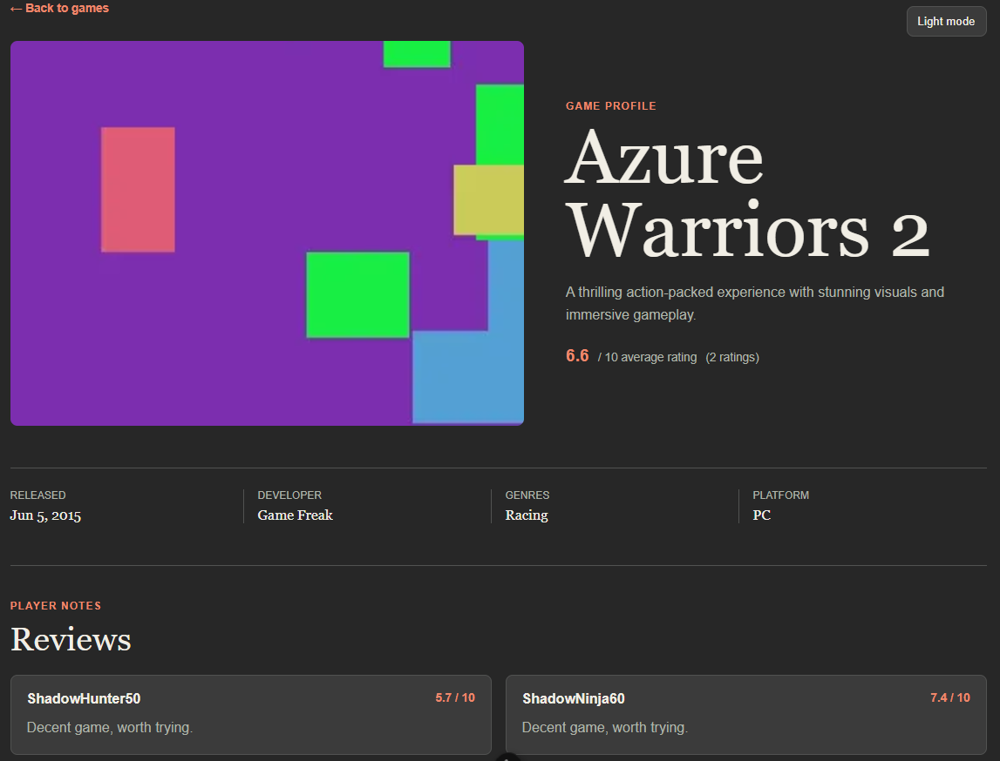

# Game World

A Nuxt 4 and TypeScript client for the Merkle Games REST API. It presents 15 randomly selected games released from 2015 through 2017, with average-rating sorting by default and release-date sorting as an alternative.

## Screenshots

### Home page

| Light Mode | Dark Mode |
|------------|-----------|
|  |  |

### Details Page

| Light Mode | Dark Mode |
|------------|-----------|
|  |  |


## Requirements

- Node.js 24.3 or newer
- The API running at `http://localhost:8000`

## Setup

Make sure to install dependencies from client directory:

```bash
# npm
npm install

# pnpm
pnpm install

# yarn
yarn install

# bun
bun install
```

## Development Server

Start the development server on `http://localhost:3000`:

```bash
# npm
npm run dev

# pnpm
pnpm dev

# yarn
yarn dev

# bun
bun run dev
```

Open `http://localhost:3000` after the Nuxt development server starts. Start the API separately from `../server` using the instructions in [the server README](../server/README.md).

## Production

Run the unit tests:

```bash
# npm
npm run test

# pnpm
pnpm test

# yarn
yarn test

# bun
bun run test
```

## Production

Build the application for production:

```bash
# npm
npm run build

# pnpm
pnpm build

# yarn
yarn build

# bun
bun run build
```

Locally preview production build:

```bash
# npm
npm run preview

# pnpm
pnpm preview

# yarn
yarn preview

# bun
bun run preview
```

Check out the [deployment documentation](https://nuxt.com/docs/getting-started/deployment) for more information.

## Implementation Notes

- The client calls only REST endpoints. It first requests game IDs from `/games/by-date-range`, randomly selects 15 IDs, then requests each game and its stats.
- Game detail responses supply the genre, developer, images, and reviews needed by the assignment. The stats endpoint supplies the average rating and rating count.
- Sorting is implemented client-side using average rating and release date for the selected 15 games.
- The interface uses SCSS variables and responsive CSS without Tailwind or a component library.
- Light and dark themes are provided by `@nuxtjs/color-mode` and can be switched from either page.
